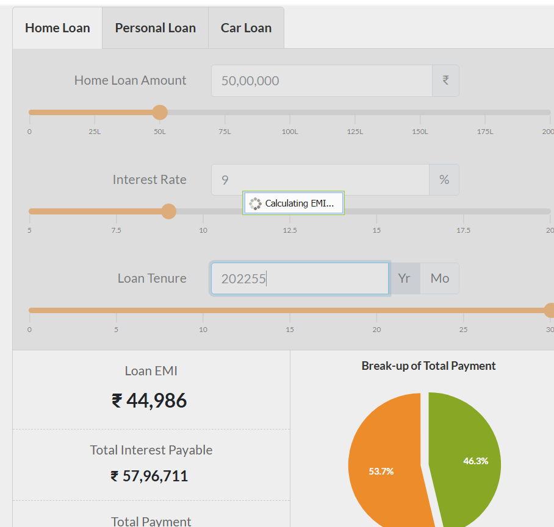

## Bug Report

### Title
Application becomes unresponsive when entering a very large value in Loan Tenure field

---

### Summary
When a very large numeric value is entered in the Loan Tenure input field, the application continues loading for an extended period and fails to calculate the EMI. The system does not restrict the input or display any validation message, resulting in an unresponsive UI.

---

### Steps to Reproduce
1. Navigate to https://emicalculator.net/  
2. Select **Home Loan Calculator**  
3. Enter a valid Loan Amount (e.g., 50,00,000)  
4. Enter a valid Interest Rate (e.g., 8.5%)  
5. Manually enter a very large number (e.g., `999999`) in the **Loan Tenure** field 
6. Click enter or outside of Loan Tenure field 
7. Observe the application behavior  

---

### Expected Result
- The application should restrict the maximum allowed value for Loan Tenure, **or**  
- Display a validation message indicating that the entered tenure is invalid  
- The application should remain responsive and continue to function normally  

---

### Actual Result
The application enters a continuous loading state for several minutes and fails to calculate EMI. No validation or error message is displayed, and the UI becomes unresponsive.

---

### Severity
High

---

### Priority
High